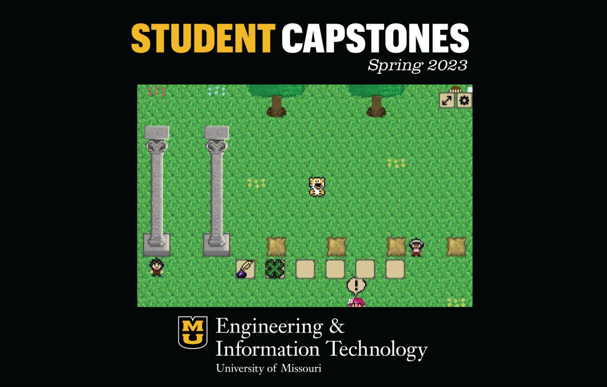

## Projects

### The Missing Columns

The Missing Columns, nicknamed ZouQuest, was designed to help new students at Mizzou familiarize themselves with campus and university history.

Read about it [here!](https://engineering.missouri.edu/2023/information-technology-students-create-mizzou-trivia-game-for-capstone-project/)

### Bookshelf

Bookshelf is an app programmed in Java to help users organize a virtual collection of books. They can add new items to a collection and track their progress with a visual representation of pages read.

[Documentation](https://github.com/KurtU0/bookshelf)

